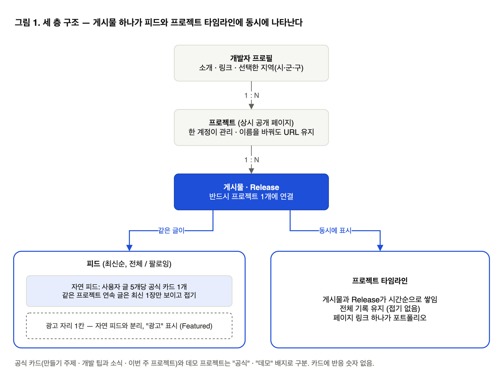
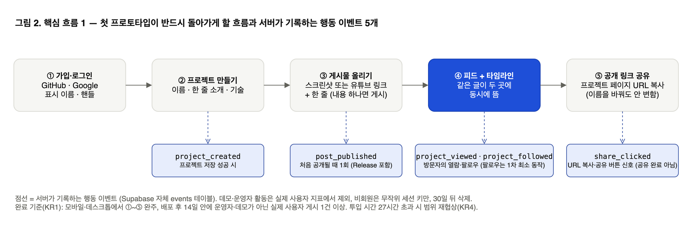
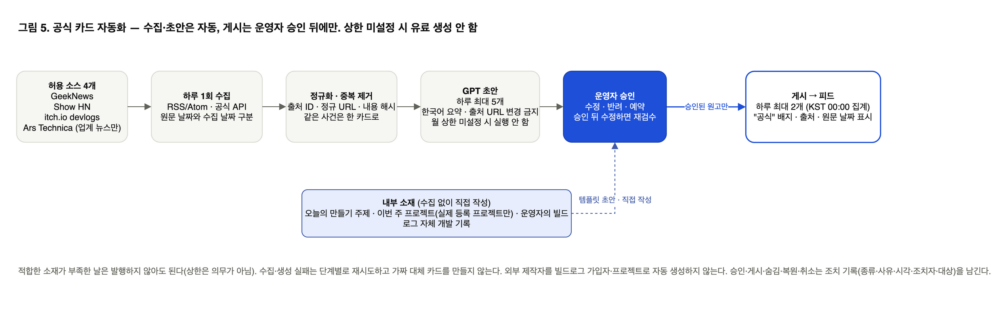
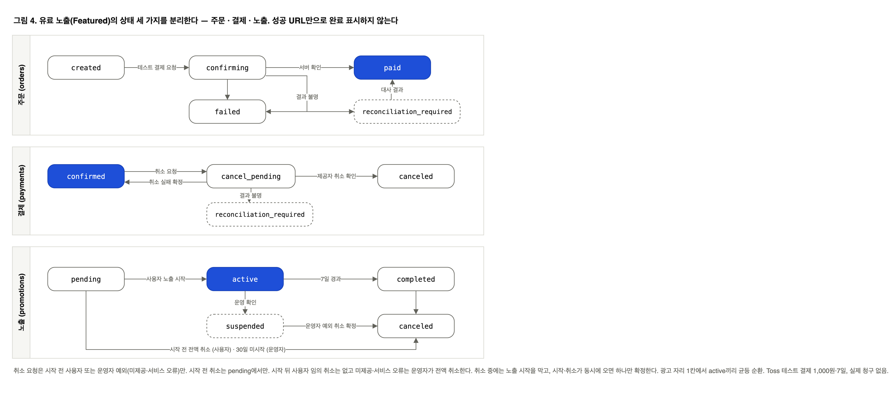
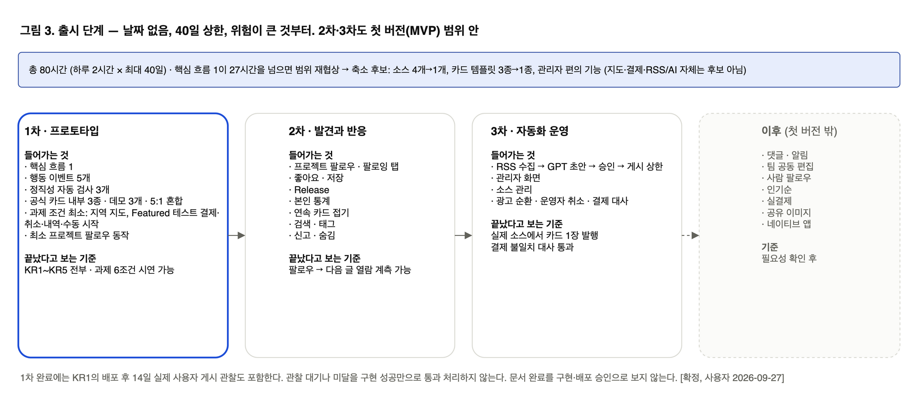

# PRD — 빌드로그

작성일: 2026-09-27 · 상태: **권고안 채택 [확정, 사용자 2026-09-27] / 정본 반영 완료** · 앱 미구현 · 대상: 실제 서비스 `buildlog`

이 문서는 **이 파일 하나만 있어도 읽히도록** 만든 제품 요구사항 문서(PRD)다. 다른 파일을 열지 않아도 되게 용어집·결정 요약·화면 목록·규칙·데이터·조사 결과·검토 결과·디자인 값을 부록에 그대로 담았고, 그림 5장은 파일 안에 이미지로 내장했다. 이미지는 VS Code 미리보기나 일반 Markdown 뷰어에서 보이며, GitHub 웹 화면에서는 내장 이미지가 보이지 않을 수 있다. 원본 저장소의 세부 규칙과 이 문서가 다르면 원본이 우선하고, 원본 위치는 부록 K에 있다.

**표기 읽는 법.** [확정] = 사용자가 결정한 것 · [제안] = 검토용 권장안 · [기본값 제안] = 원칙은 확정, 숫자 기본값은 구현 시 변경 가능 · [가정] = 아직 확인 못 한 믿음 · [미정] = 결정 전. 숫자 목표는 근거가 있는 것만 적고, 근거 없는 사용자 수·매출 목표는 만들지 않는다.

**차례.** 1 요약 · 2 관계자 · 3 배경 · 4 목표와 성과 기준 · 5 누구를 위해 · 6 우리가 주는 가치 · 7 해결책(그림 1·2·4·5) · 8 출시 계획(그림 3) · 부록 A 용어집 · B 결정 요약(Q1~Q24, D1~D11, A1~A5) · C 되돌리기 비싼 결정 3개 · D 화면 15개 · E 비즈니스 규칙 · F 데이터 · G 조사 결과 · H 실패 시나리오 검토 상태 · I 디자인 값 · J 자원·제약 · K 원본 위치

## 1. 요약

빌드로그는 앱·웹·게임을 만드는 사람이 **오늘 만든 화면 한 장이나 유튜브 링크 하나를 붙여 올리면**, 그 글이 피드에 뜨고 같은 글이 프로젝트 페이지에 개발 기록으로 쌓이는 서비스다. 글을 길게 쓰지 않아도 프로젝트가 꾸준히 알려지게 하는 것이 목적이다. 첫 버전은 최대 40일·하루 2시간(총 80시간 상한) 안에 1인이 만들며, 과제 조건(회원·CRUD·지도·결제·취소·내역)을 함께 만족한다.

## 2. 관계자

| 역할 | 누구 | 메모 |
|---|---|---|
| 제품 소유자·개발자·운영자 | 사용자 본인(1인) | 제품 결정(Q1~Q24, D1~D11)을 내렸고, 개발·하루 검수·자체 개발 기록 게시를 모두 맡는다. 출시 전 인터뷰는 불가. |
| 문서·조사 지원 | 코디네이터(Claude)와 조사 워커(Codex) | 정본 문서·실패 시나리오 검토·공개 관찰 조사를 작성했다. 제품 결정은 하지 않는다. |
| 첫 사용자 후보 | 인디 개발자·소규모 팀, 새 앱·게임을 찾는 사람 | 아직 확보되지 않았다. 배포 후 관찰로 확인한다(§7.4). |

## 3. 배경

**어떤 일인가.** 인디 개발자는 만드는 데 시간을 다 쓰고 알리는 데는 쓰지 못한다. 긴 글을 쓰기 어렵고, 한 번 올린 글은 흘러가 버리며, 출시 뒤에는 다시 소개할 계기가 없다. 소개 사이트(`buildlog-showcase`)는 이미 공개돼 "스크린샷 한 장 + 한 줄", "유튜브 링크가 그대로 게시물", "페이지 링크 하나로 프로젝트 전체 소개"를 약속했다. 실제 서비스는 이 약속을 지켜야 한다.

**왜 지금인가.**
- 유튜브에 개발 영상 기록(devlog)을 올리는 사람이 늘었다. 링크만 붙이면 게시물이 되는 방식이 이 집단에 바로 맞는다. [사용자 원문]
- 과제 조건과 40일 상한이 정해져 있어, 작은 범위로 실제 서비스를 만들 시점이다.
- GPT 구독(GPT Pro 5X)이 있어 공식 카드 초안 자동 생성을 큰 비용 없이 붙일 수 있다. [사용자 2026-09-27]

**이미 있는 것과 없는 것.** 디스콰이엇은 "게시물이 제품에 붙는다 + 제품 페이지에 기록이 쌓인다 + 최신순 피드"를 이미 제공한다(부록 G-1). 그래서 "새 글을 올리면 프로젝트가 다시 앞에 뜬다"는 기능은 우리만의 강점이 아니라 **당연히 있어야 하는 기본 기능**이다. [확정, 2026-09-26] 우리가 다르게 하려는 것은 §6에 있다.

## 4. 목표와 성과 기준

**목표.** 개발자가 오늘 만든 것 하나로 프로젝트를 꾸준히 알릴 수 있는 곳을 만든다. 글쓰기 부담을 없애고, 기록이 프로젝트에 남게 하고, 작아도 정직한 피드를 유지한다.

**왜 중요한가.** 제작자에게는 홍보 비용이 줄고 포트폴리오가 저절로 쌓인다. 방문자에게는 완성 전 프로젝트를 구경하고 응원할 곳이 생긴다. 회사(1인 운영자)에게는 실제로 쓰이는 서비스와 과제 완료가 동시에 나온다.

**성과 기준 [확정, 사용자 2026-09-27].** 숫자는 기존 문서에 근거가 있는 것만 썼다. 사용자 수·매출 목표는 없다.

| 번호 | 무엇을 확인하나 | 기준 | 근거 |
|---|---|---|---|
| KR1 | 핵심 흐름 1(가입 → 프로젝트 → 게시 → 피드·타임라인 동시 표시 → 공유 링크)이 실제로 돌아간다 | 모바일·데스크톱에서 완주. 배포 후 14일 안에 운영자·데모가 아닌 실제 사용자의 게시 1건 이상 | 제품 명세 완료 기준, 공개 관찰 실험안 B5(부록 G-5) |
| KR2 | 과제 조건을 시연할 수 있다 | 회원가입·로그인, 프로젝트 CRUD, 지역 지도, 테스트 결제·취소·내역 6개 모두 시연 | 로드맵 "과제 조건과 증거 연결" |
| KR3 | 정직성 규칙이 코드로 지켜진다 | 자동 검사 3개 통과: 공식/데모/광고 배지 표시, 카드에 반응 숫자 없음, 광고가 자연 피드에 섞이지 않음 | 검토 항목 K-13(부록 H), 기술 명세 검증 계약 |
| KR4 | 시간 예산 안에서 만든다 | 핵심 흐름 1 투입 시간 27시간 이하(총 80시간의 1/3을 약 27시간으로 잡은 기준). 넘으면 범위 재협상 | 검토 항목 K-3(부록 H), 로드맵 측정 표 |
| KR5 | 행동을 측정할 수 있다 | 이벤트 5개(프로젝트 생성·게시·프로젝트 열람·공유 클릭·팔로우)가 서버에 기록되고 데모·운영자가 제외된다 | 행동 이벤트 정의(부록 F-4), 도구 조사(부록 G-3) |

## 5. 누구를 위해 만드나

시장은 나이·직업이 아니라 **하려는 일**로 나눈다.

| 대상 | 하려는 일 | 지금 겪는 어려움 |
|---|---|---|
| 1차: 혼자 만드는 인디 개발자 | 만드는 중에도 프로젝트를 알리고 싶다 | 글 쓸 시간이 없다. 올린 글이 흘러간다. 출시 뒤 다시 소개할 계기가 없다 |
| 1차: 소규모 팀·개발사 | 팀 프로젝트 진행 과정을 링크 하나로 보여주고 싶다 | 여러 채널에 흩어진 기록을 한 곳에 모으기 어렵다 |
| 2차: 새 앱·게임을 찾는 사람, 동료 개발자 | 완성 전 프로젝트를 먼저 구경하고 응원하고 싶다 | 개발 중인 프로젝트를 모아 볼 곳이 없다 |

**제약.**
- 한국어 사용자 우선. 모바일 브라우저에서 올리고 구경하는 흐름 우선.
- 운영자·개발자·첫 제작자가 같은 사람이다. 하루 검수는 게시 2개가 현실적 천장이다.
- 총 80시간(하루 2시간 × 최대 40일) 상한. [확정, 2026-09-27]
- 출시 전 인터뷰 불가. 제작자가 두 번째 글을 올릴지, 팔로우한 사람이 돌아올지는 공개 관찰로도 확인하지 못했다(§7.4).
- 대상 규모(국내 인디 개발자·유튜브 devlog 제작자 수)는 근거가 없다.

## 6. 우리가 주는 가치

**하려는 일 → 얻는 것 → 피하는 것.**

| 하려는 일 | 얻는 것 | 피하는 것 |
|---|---|---|
| 오늘 만든 것을 알린다 | 붙여넣기 하나(이미지 또는 URL)로 게시 끝. 유형 선택 없음 | 긴 글 쓰기, 카드 디자인, 여러 채널에 따로 올리기 |
| 기록을 남긴다 | 같은 글이 프로젝트 페이지에 시간순으로 쌓인다. 페이지 링크 하나가 포트폴리오 | 흘러간 글을 다시 찾기, 별도 포트폴리오 관리 |
| 다시 알린다 | 새 글·Release를 올리면 프로젝트가 피드에 다시 뜬다(기본 기능) | 출시 한 번으로 끝나는 노출 |
| 구경하고 응원한다 | 프로젝트를 팔로우하면 팔로잉 탭에서 다음 글을 본다. 좋아요·저장 | 사람 팔로우, 숫자 경쟁 |

**남들과 다른 점 [확정, 2026-09-26].** 재노출은 기본 기능이다. 차별점 후보는 세 가지다.
1. **붙여넣기 하나로 게시.** 이미지·유튜브·GitHub·웹 링크를 자동 판별. 내용 하나만 있으면 게시.
2. **유튜브·Shorts 개발 영상 링크가 그대로 게시물.** 영상 기록을 이미 만드는 사람을 위한 진입점.
3. **정직한 공식 콘텐츠와 숫자 없는 피드.** 가짜 반응·후기·가격 금지, 데모는 데모라고 표시, 광고는 광고라고 표시, 카드에 반응 숫자를 보이지 않음. 초기 사용자가 적어도 "죽은 서비스"로 보이지 않게 공식 카드 3종이 피드를 채운다.

**무엇을 낮추고 무엇을 높이나.**
- 낮춤·없앰: 글 길이, 반응 숫자 경쟁, 댓글·알림함(첫 버전 제외), 사람 팔로우, 정확한 주소 수집.
- 높임·새로 만듦: 게시 속도, 프로젝트 단위 기록, 공식/데모/광고 구분의 정직함, 유튜브 링크 게시, 같은 프로젝트 글이 연속되면 접어서 한 사람이 피드를 독점하지 않게 함.

## 7. 해결책

### 7.1 화면과 흐름

세 층 구조: **개발자 프로필 → 프로젝트(상시 페이지) → 게시물(프로젝트에 반드시 연결)**. 게시물 하나가 피드와 프로젝트 타임라인 양쪽에 나타난다.



시작 3단계(온보딩): ① 프로젝트 만들기(이름·한 줄 소개·기술) → ② 오늘 만든 것 올리기(스크린샷 또는 유튜브 링크 + 한 줄) → ③ 페이지 링크 공유.

핵심 흐름 1(첫 프로토타입이 반드시 돌아가게 할 흐름):

```text
가입(GitHub·Google) → 프로젝트 만들기 → 게시물 올리기
→ 같은 글이 피드와 프로젝트 타임라인에 동시에 뜸 → 공개 링크 공유
```



화면 15개의 목록은 부록 D, 공통 상태(로딩·빈 화면·오류)와 디자인 값은 부록 I에 있다. 피드 카드는 아바타·이름·핸들 / 이미지 또는 영상 / 좋아요·공유·저장 / 한 줄 설명 / 프로젝트 칩으로 구성하고 반응 숫자는 없다.

### 7.2 주요 기능

전부 [확정] 정책이다. 상세 규칙 번호(BR)는 부록 E에 있다.

| 영역 | 첫 버전에 들어가는 것 | 나중으로 미룬 것 |
|---|---|---|
| 회원 | GitHub·Google 로그인, 표시 이름·핸들, 프로필(소개·링크·선택 지역) | 이메일 가입, 수동 계정 연결 UI |
| 프로젝트 | 만들기·보기·고치기·지우기, 기술 칩, 링크, 스크린샷, 공개 URL(이름 바꿔도 안 변함). 한 계정이 관리 | 팀원 초대·공동 편집·소유권 이전 |
| 게시 | 입력창 하나. 글·이미지/GIF(합계 4개, 40MB)·대표 링크 1개 혼합. 내용 하나만 있으면 게시. 유튜브/Shorts·GitHub·일반 URL 카드 자동 생성 | 직접 동영상 업로드, 앱스토어 카드 |
| 타임라인·Release | 게시물과 Release가 시간순으로 쌓임. Release는 버전·제목·바뀐 점 입력, 버전 표기 자유 | 버전 비교 |
| 피드 | 최신순. 새 글·Release로 프로젝트가 다시 앞에 뜸. 편집·좋아요는 순서를 바꾸지 않음. 같은 프로젝트 글이 연속되면 최신 1장만 보이고 "이전 글 N개 펼치기". 메인은 사용자 글 5개당 공식 카드 1개, 팔로잉 탭은 팔로우한 프로젝트 글만 | 인기순, 개인화 |
| 반응 | 프로젝트 팔로우, 좋아요, 비공개 저장. 카드에 숫자 없음. **글쓴이 본인만** 자기 글·프로젝트의 좋아요·저장·팔로우 수를 본인 화면에서 봄 | 댓글, 알림함, 사람 팔로우 |
| 공식 카드 | 3종: 오늘의 만들기 주제 / 개발 팁과 소식 / 이번 주 프로젝트. 데모 프로젝트 3개("데모" 표시). 운영자의 빌드로그 자체 개발 기록 | 성과 기반 주제 선택 |
| 자동화 | 허용 소스 4개(GeekNews, Show HN, itch.io devlogs, Ars Technica는 업계 뉴스만)에서 하루 1회 수집 → GPT 초안 하루 최대 5개 → 운영자 승인 → 하루 최대 2개 게시. 출처·날짜 표시. 상한 미설정 시 유료 생성 안 함 | 무검수 자동 게시, 소스 확대, 주간 다이제스트(7일 관찰 후 판단) |
| 유료 노출 | Featured 한 상품. Toss 테스트 결제 1,000원·7일(실제 청구 없음). 결제 후 사용자가 직접 "노출 시작", 시작 전 전액 취소, 내역 조회. 광고 자리 1칸에서 순환, 자연 피드와 분리, "광고" 표시. 같은 프로젝트 중복 구매 불가, 30일 미시작 주문은 운영자 취소 | 실결제, Boost·Release Spotlight |
| 지도 | 프로필에 시·군·구만 선택 공개(기본 비공개), Kakao 지도에 지역 중심 표시. 정확한 주소 수집 안 함 | 주변 검색, 현재 위치 |
| 운영 | 신고 → 운영자 숨김/복원. 삭제·탈퇴는 즉시 비공개, 30일 뒤 원문 정리. 조치 기록(종류·사유·시각·조치자·대상). 문의 이메일 링크(더미 주소, 출시 전 교체) | 자동 제재 |
| 측정 | 행동 이벤트 5개를 서버가 기록. 데모·운영자 제외. 비회원은 무작위 세션 키만, 계정과 연결 안 함. 30일 뒤 삭제. 운영자만 집계 조회 | 추가 지표 |

공식 카드 자동화의 흐름은 다음과 같다. 수집과 초안은 자동이지만 게시는 운영자 승인 뒤에만 일어난다.



### 7.3 기술

- Next.js(App Router) + Supabase(DB·Auth·Storage·RLS) + Vercel. 지도 Kakao Maps, 결제 Toss Payments 테스트, AI는 GPT 5.6 Luna(사용자 지정; 가격표상 `gpt-6-luna`가 더 저렴한 대안). [확정]
- 도메인은 Vercel 기본 호스트(`*.vercel.app`), 문의 이메일은 더미(`contact@buildlog.example`)로 시작. Supabase 공식 문서상 커스텀 도메인 없이 GitHub·Google 로그인이 가능하다. 실제 로그인 확인은 사용자 실행 체크리스트(부록 G-4)로 한다. [확정·조사 완료]
- 행동 기록은 Supabase 안의 자체 `events` 테이블, 30일 정리는 Supabase Cron(`pg_cron`), 비회원 키는 서버 발급 `HttpOnly; Secure; SameSite=Lax; Path=/` 쿠키(`Domain` 생략·30분 절대 만료·자동 연장 없음), 운영자 집계는 SQL 뷰 1개와 관리자 페이지 1개로 구성한다. [확정, 사용자 2026-09-27; 조사 근거는 부록 G-3]. 정리 지연·프로젝트 중지·백업 사본을 포함한 Q20 완전 준수는 구현 검증 후 판정한다.
- 결제·노출은 주문·결제·노출 세 상태를 분리하고 "확인 중" 상태를 둔다. 성공 URL만으로 완료 표시하지 않는다.
- 데이터 항목(엔터티) 이름과 역할은 부록 F에 있다. 세부 필드·API 27개는 원본 기술 명세(부록 K)에 있다.



### 7.4 가정 (아직 확인 못 한 것)

실패 시나리오 검토(부록 H)에서 공격했지만 출시 전에는 확인할 수 없어 남은 것들이다. 첫 버전에서 관찰로 확인한다.

| 가정 | 왜 위험한가 | 어떻게 확인하나 |
|---|---|---|
| 게시가 쉬우면 제작자가 두 번째 글도 올린다 | 반응이 없으면 연재는 멈춘다. 본인 통계(Q19)로 일부 보완했지만 검증 전 | 배포 후 프로젝트별 게시 횟수 분포 |
| 팔로우한 사람이 알림 없이도 돌아온다 | 알림함이 없어 재방문 원인이 밖(외부 공유 링크·습관)에 있어야 한다 | 팔로잉 탭 열람 계측(추가 이벤트, 도구 결정과 함께) |
| 운영자 외 첫 제작자가 생긴다 | 출시 피드가 운영자 1명 + 데모면 "한 사람 사이트"로 보인다 | 배포 후 14일 안에 실제 사용자 게시 1건 |
| 하루 2개 소식 카드 소재가 충분하다 | 1일차 관찰은 충족, 나머지 6일 미수집. GeekNews와 겹칠 수 있다 | 소스 수집 2~7일차(후속) |
| 80시간 안에 첫 버전이 나온다 | 외부 연동 6종·화면 14·API 27을 넣기엔 빡빡하다 | 핵심 흐름 1 투입 시간 측정, 27시간 초과 시 재협상 |
| GPT 구독이 API 사용까지 덮는다 | 서비스 안 자동 생성은 보통 토큰 과금이 별도다 | 연동 시 청구 방식 확인, 월 상한 기본값 $5 |
| 30일 삭제가 백업까지 미친다 | DB 삭제와 백업 사본 보존은 다르다 | 구현 시 정리 작업·백업 정책 확인 |

## 8. 출시 계획

날짜는 정하지 않는다. 40일은 상한이고 순서는 위험이 큰 것부터다. 총 80시간 예산 안에서 아래 순서로 만들되, 핵심 흐름 1이 27시간을 넘으면 범위를 다시 정한다(축소 후보: 소스 4개 → 1개, 카드 템플릿 3종 → 1종, 관리자 편의 기능. 지도·결제·RSS/AI 자체는 사용자 결정 범위라 후보에 넣지 않음). [확정, 사용자 2026-09-27]

아래 출시 단계와 완료 기준도 [확정, 사용자 2026-09-27]이다.

| 단계 | 들어가는 것 | 끝났다고 보는 기준 |
|---|---|---|
| **1차: 프로토타입** | 핵심 흐름 1 + 행동 이벤트 5개 + 정직성 자동 검사 3개 + 공식 카드 내부 3종·데모 3개·5:1 혼합 + 과제 조건 최소(지역 지도, Featured 테스트 결제·취소·내역·수동 시작) | KR1~KR5 전부. 과제 6조건 시연 가능 |
| **2차: 발견과 반응** | 프로젝트 팔로우·팔로잉 탭, 좋아요·저장, Release, 본인 통계, 연속 카드 접기, 검색·태그, 신고·숨김 | 팔로우 → 다음 글 열람 계측 가능 |
| **3차: 자동화 운영** | RSS 수집 → GPT 초안 → 승인 → 게시 상한, 관리자 화면, 소스 관리, 광고 순환·운영자 취소·대사 | 실제 소스에서 카드 1장 발행, 결제 불일치 대사 통과 |
| 이후 | 댓글·알림, 팀 공동 편집, 사람 팔로우, 인기순, 실결제, 공유 이미지, 네이티브 앱 | 필요성 확인 후 |



KR5의 5개 이벤트를 1차에 확인하기 위한 최소 프로젝트 팔로우 동작은 1차에 포함하고, 팔로잉 탭·다음 글 열람 흐름은 2차에서 확장한다. KR1의 배포 후 14일 실제 사용자 게시 관찰도 완료 기준에 포함하며, 관찰 대기나 미달을 구현 성공만으로 통과 처리하지 않는다.

2차·3차는 모두 첫 버전(MVP) 범위 안이다. 순서만 위험 순이며 40일 상한 안에 들어가지 않으면 사용자에게 알리고 범위를 조정한다. 문서 완료를 구현·배포 승인으로 보지 않는다.

---

## 부록 A. 용어집

원본 `CONTEXT.md`의 정의를 그대로 옮겼다. 이 문서 본문의 도메인 용어는 이 뜻으로 읽는다.

| 용어 | 뜻 | 이렇게 부르지 않음 |
|---|---|---|
| 개발자 프로필 (Developer Profile) | 프로젝트 제작자를 소개하고 그 제작자의 프로젝트들을 모아 보여주는 공개 소개 | 프로젝트 계정, 팀 계정(공동 관리 기능을 뜻하는 경우) |
| 프로젝트 (Project) | 개발자가 만드는 앱·웹·게임과 그 소개·링크·개발 과정을 묶는 지속적인 공개 단위 | 출시 이벤트, 게시물 모음(프로젝트 자체와 같은 뜻으로 사용하는 경우) |
| 프로젝트 소유자 (Project Owner) | 프로젝트를 생성해 관리하는 한 계정의 제작자. 팀명은 소개 정보이며 다른 팀원에게 관리 권한을 부여하는 개념이 아님 | 공동 소유자, 팀 계정 관리자 |
| 게시물 (Post) | 하나의 프로젝트에서 만든 것 또는 바뀐 점을 짧은 설명·이미지·외부 링크로 공유하는 개별 기록 | 일상 글, 피드(개별 게시물을 가리키는 경우) |
| 피드 (Feed) | 여러 프로젝트의 게시물과 구별된 공식 콘텐츠를 발견하는 목록 | 타임라인(한 프로젝트의 이력과 혼용하는 경우) |
| 프로젝트 타임라인 (Project Timeline) | 한 프로젝트의 게시물과 Release를 시간에 따라 모아 보여주는 개발 이력 | 전체 피드, 출시 목록 |
| Release | 프로젝트의 특정 버전 공개 또는 배포를 개발자가 자유롭게 정한 버전명·제목·변경 내용으로 알리는 특별한 게시물 | 유료 노출, 일반 편집(Release와 같은 의미로 쓰는 경우) |
| 프로젝트 팔로우 (Project Follow) | 관심 있는 프로젝트의 다음 게시물을 팔로잉 피드에서 보기 위해 맺는 관계 | 개발자 팔로우, 이메일 구독, 알림 신청 |
| 재노출 | 새 개발 게시물이나 Release를 통해 프로젝트를 다시 발견할 기회가 생기는 것 | Boost(유료 상품과 혼용), 상단 고정(보장되지 않은 노출을 뜻하는 경우) |
| 공식 카드 (Official Card) | 빌드로그가 제공하는 만들기 주제·개발 팁과 소식·프로젝트 소개 콘텐츠. 소식에는 인디 뉴스·포럼 소개와 주요 업계 뉴스가 포함됨 | 사용자 게시물, 광고(모든 공식 카드를 광고로 부르는 경우) |
| 수집 소재 (Source Item) | 소식 카드의 근거로 수집한 외부 뉴스나 포럼의 개별 글. 빌드로그 회원이 직접 올린 게시물과 구분 | 빌드로그 게시물, 신규 회원 활동 |
| 데모 프로젝트 (Demo Project) | 사용 방법과 표현 예시를 보여주기 위해 허구임을 명시한 프로젝트 | 실제 사용자 프로젝트, 인기 프로젝트(데모라는 사실을 감추는 경우) |
| 유료 노출 (Paid Promotion) | 제작자가 비용을 내고 프로젝트 또는 게시물을 추가로 소개하는 서비스 | 재노출(정상 게시에 따른 자연 노출과 혼용) |
| Featured | 프로젝트를 광고로 구분해 추가 소개하는 노출 상품. 첫 버전은 테스트 결제로 제공 | Boost, Release Spotlight, 자연 인기순 |
| 팀 위치 | 제작자나 팀이 소개에 선택적으로 공개하는 시·군·구 수준의 활동 지역 | 정확한 주소, 현재 위치, 주변 프로젝트(위치 기반 탐색을 뜻하는 경우) |
| 연속 카드 접기 | 같은 프로젝트의 연속 게시물을 자연 피드에서 최신 1장으로 접어 보여주는 표시 규칙 [확정, 사용자 2026-09-26] | 정렬 변경, 게시물 숨김 |

## 부록 B. 결정 요약

번호는 원본 문서와 같으며 바꾸지 않는다. 각 줄은 원본 PLAN-001의 확정 답변을 요약한 것이고, 답변 원문은 원본(부록 K)에 있다.

### B-1. 첫·두 번째 문답 Q1~Q14 [확정, 2026-09-17]

| 번호 | 주제 | 확정 답변 |
|---|---|---|
| Q1 | 기반 스택·가입 방식 | "제안 조합 채택 (권장)". Supabase(Auth/DB/Storage)·Vercel·GitHub/Google 로그인·Kakao 지도. 위치 입력은 선택. 이메일 가입은 선택하지 않음 |
| Q2 | 프로젝트 관리 주체 | "한 계정이 관리 (권장)". 팀명은 소개 정보, 초대·공동 편집·소유권 이전은 MVP 이후 |
| Q3 | 소셜 경험 | "권장 구성 채택". 프로젝트 팔로우·좋아요·저장 제공. 댓글·별도 알림함·개발자 팔로우는 이후, 카드 반응 숫자는 숨김 |
| Q4 | 기본 피드 | "최신순과 새 게시 재노출 (권장)". 편집·좋아요로 게시 시각을 올리지 않음 |
| Q5 | 공식 콘텐츠 자동화 | "외부 RSS·AI 원고까지 포함". 추가 요청: 인디 관련 뉴스·포럼을 주기적으로 가져오고 때론 업계 최신 뉴스도 다룸 |
| Q6 | 유료 상품과 결제 범위 | "Featured 한 상품·테스트 결제 (권장)". 전액 취소·내역 포함. 실결제·다른 상품은 이후 |
| Q7 | 실행 조건 | "미정, AI는 우선은 gpt 사용 예정" → 2026-09-27 추가 답변은 B-4 참조 |
| Q8 | 수집·발행 | "하루 1회 수집·승인 후 최대 2개 게시 (권장)". AI 초안 최대 5개 |
| Q9 | 게시물 구성 | "혼합 첨부·내용 하나 이상 (권장)". 후속: "제안한 제한 채택 (권장)" — 본문 2,000자, 이미지/GIF 합계 4개, 정적 10MB·GIF 20MB·전체 40MB, 대표 URL 1개(변경 가능) |
| Q10 | Release의 의미 | "특별한 게시물 유형 (권장)". 후속: "우리가 개발자의 버전명을 강제할 순 없다. 자유 원칙" — 중복 금지·버전 고정 권장안은 기각 |
| Q11 | 위치 공개 | "기본 비공개·지역만 공개 (권장)". 시·군·구와 지역 중심 지도만, 정확한 주소 미수집 |
| Q12 | Featured 조건 | "수동 시작·시작 전 취소 (권장)". Toss 테스트 1,000원·7일. 시작 후 사용자 취소 불가, 미제공·서비스 오류는 운영자 전액 취소 |
| Q13 | 운영·삭제 | "운영자 검토·공개 종료 후 30일 정리 (권장)". 신고는 운영자 숨김/복원, 삭제·탈퇴는 즉시 공개 종료 후 30일 유예 뒤 원문/파일 정리 |
| Q14 | 피드 혼합 | "메인 혼합·팔로잉은 프로젝트 글만 (권장)". 사용자 글 5개당 공식 카드 1개, 부족하면 공식/데모로 보충 |

### B-2. 세 번째 문답 Q15~Q24 [확정, 사용자 2026-09-26, 권장안 채택]

사용자가 "판단 대기 항목은 모두 권장안으로 진행"이라고 결정했다. 숫자 기본값은 [기본값 제안]으로 구분한다.

| 번호 | 주제 | 확정 정책 |
|---|---|---|
| Q15 | 소식 카드 허용 소스 | GeekNews·Show HN·itch.io devlogs·Ars Technica 4개. Ars Technica는 업계 뉴스 용도로만. 적합 소재가 부족한 날은 발행하지 않아도 된다(Q8은 상한). 주간 다이제스트 채택은 7일 관찰 후 결정 [미정 유지] |
| Q16 | Featured 운영 상세 | 광고 자리 1칸·활성 노출끼리 균등 순환. 같은 프로젝트에 활성 또는 시작 대기 주문이 있으면 추가 구매 불가. 결제 후 30일 안에 시작하지 않은 주문은 운영자 전액 취소 대상(Q13의 30일 상수 재사용). 슬롯·순환·30일은 [기본값 제안] |
| Q17 | 데모 프로젝트 | 작은 타이머·달빛 정원사·레시피 메모 3개로 시작, 기능 변경·예시 노후 시 교체. 좋아요·저장 허용하되 실제 사용자 집계에서 제외, "데모" 표시 유지 |
| Q18 | 운영자 지정 | 사용자 본인 계정에 명시적 운영자 역할 부여. 개발자라는 이유로 자동 권한 없음. 승인·게시·숨김·복원·취소를 `moderation_actions` 등에 기록 |
| Q19 | 작성자 본인 통계 | 본인 게시물·본인 프로젝트의 좋아요 수·저장 수·프로젝트 팔로우 수 제공. 프로젝트 관리·게시물 상세 본인 보기·프로필 본인 보기에서만 표시. 카드 숫자 숨김(Q3)·가짜 반응 금지·댓글/알림함 이후 범위 유지 |
| Q20 | 행동 데이터 정책 | 행동 이벤트는 30일 후 삭제 또는 익명화(Q13 상수 재사용, [기본값 제안]). 비회원 세션은 가입 계정·다른 기기에 연결하지 않음. 집계 접근은 운영자 역할만 |
| Q21 | 재노출 소개 문구 | 재노출은 차별점이 아닌 기본 제공 가치(기본 기능). 차별점 후보는 붙여넣기 하나로 게시 / 유튜브·Shorts devlog 링크 게시 / 정직한 공식 콘텐츠. 외부 소개는 실제 동작 중심, 경쟁 비교 카피 금지 |
| Q22 | OAuth 계정 연결 | Supabase Auth 제공자의 기본 계정 연결 동작을 따름. 소유 확인 없는 임의 병합 금지, 수동 연결 UI는 MVP 제외 |
| Q23 | 수집·게시 시간 정책 | 일일 상한은 KST 00:00 기준 집계, 예약·게시 시각은 KST 표시. 지연·재시도는 원래 날짜 집계 유지, 중복 발행 금지 |
| Q24 | 삭제·운영 기록 | 최소 감사 항목은 조치 종류·사유·시각·조치자·대상 ID. 이의 제기는 설정 화면의 문의 링크(이메일)로 받음. 주소는 2026-09-27 결정으로 더미 `contact@buildlog.example` 사용, 출시 전 교체. Q13 즉시 공개 종료·30일 정리 유지 |

### B-3. 실패 시나리오 검토 뒤 결정 D1~D11 [확정, 사용자 2026-09-26]

| 결정 | 현재 정책 |
|---|---|
| D1·Q21 | 재노출은 기본 기능. 차별점 후보는 붙여넣기 게시·유튜브/Shorts devlog 링크·정직한 공식 콘텐츠 |
| D2·K-12 | 전체/팔로잉 자연 피드에서 같은 프로젝트 연속 2건 이상은 최신 1장과 "이 프로젝트의 이전 게시물 N개 펼치기"로 표시. 펼치면 원래 위치·최신순, 접힌 글에 Release가 있으면 "Release 포함" 안내. 공식 카드·광고는 접지 않고 프로젝트 타임라인은 전체 기록 유지. 페이지 응답 안에서만 접는 방식은 [기본값 제안] |
| D3·Q15 | GeekNews·Show HN·itch.io devlogs·Ars Technica 4개, Ars는 업계 뉴스만. 부족한 날 미발행 허용 |
| D4·Q16 | 광고 자리 1칸·활성 균등 순환 [기본값 제안], 활성/시작 대기 주문 추가 구매 금지, 30일 미시작 운영자 전액 취소 [기본값 제안] |
| D5·Q17 | 작은 타이머·달빛 정원사·레시피 메모 3개, 필요 시 교체·좋아요/저장 허용·데모 표시·실사용자 집계 제외 |
| D6·Q18 | 사용자 본인 계정에 명시적 운영자 역할·개발자 자동 권한 없음·승인/게시/숨김/복원/취소 기록 |
| D7·Q19 | 본인 게시물/프로젝트 좋아요·저장·프로젝트 팔로우 수를 본인 화면에 제공, 기본 카드 숫자 숨김 유지·K-1 결정 의존성 해소 |
| D8·Q20 | 행동 이벤트 30일 삭제/익명화 [기본값 제안]·비회원 가입 계정/다른 기기 연결 금지·운영자만 집계 접근 |
| D9·Q22 | Supabase Auth 기본 계정 연결·소유 확인 없는 임의 병합 금지·수동 연결 UI 제외 |
| D10·Q23 | KST 00:00 집계·예약/게시 KST 표시·지연/재시도 원래 날짜 집계·중복 발행 금지 |
| D11·Q24 | 조치 종류·사유·시각·조치자·대상 ID 감사, 설정 이메일 문의(더미 주소로 진행), Q13 유지 |

### B-4. 2026-09-27 결정: 자원과 PRD 권고안 A1~A5 [확정, 사용자 2026-09-27]

**Q7 추가 답변.** 하루 가용 시간 2시간(총 80시간 상한). 모델은 GPT 5.6 Luna(사용자 표기, 정확한 API 모델 ID는 연동 시 확인). AI 비용은 GPT Pro 5X 구독이 바탕이며, 미정으로 남긴 것은 별도 홍보·마케팅 예산이다. AI API 월 상한 기본값 $5 [기본값 제안]. 도메인은 Vercel 기본 호스트 `*.vercel.app`, 문의 이메일은 더미 `contact@buildlog.example`로 진행하고 출시 전 교체. PRD·프로토타입에 불필요한 항목(소스 수집 2~7일차 등)은 후속으로 미룸.

**PRD 권고안 채택.**
- **A1 성과 기준:** §4의 KR1~KR5와 표의 기존 숫자·근거를 그대로 채택하며, 사용자 수·매출 목표는 추가하지 않는다.
- **A2 출시 단계:** §8의 1차 프로토타입(KR1~KR5·과제 6조건), 2차 발견과 반응(팔로우 → 다음 글 열람 계측), 3차 자동화 운영(실제 소스 카드 1장 발행·결제 불일치 대사 통과)과 완료 기준을 채택하며 2·3차도 첫 버전(MVP) 범위 안이다.
- **A3 시간·재협상:** 핵심 흐름 1 실제 투입 27시간 초과 시 재협상하고 소스 4개 → 1개, 카드 템플릿 3종 → 1종, 관리자 편의 기능 순으로 축소 후보를 검토하되 지도·결제·RSS/AI 자체는 후보가 아니며 자동 축소하지 않는다.
- **A4 행동 기록 구성:** Supabase 자체 `events`·Supabase Cron(`pg_cron`) 30일 정리·서버 발급 HttpOnly 쿠키 30분 절대 만료·SQL 뷰 1개와 관리자 페이지 1개를 채택하며 Q20 완전 준수는 구현 검증 뒤 판정한다.
- **A5 정직성 검사:** KR3의 공식/데모/광고 배지·기본 카드 반응 숫자 없음·광고의 자연 피드 제외 자동 검사 3개를 1차 프로토타입 완료 조건으로 재확인한다.

## 부록 C. 되돌리기 비싼 결정 3개 (ADR 요약)

| 번호 | 결정 | 이유 요약 | 상태·출처 |
|---|---|---|---|
| ADR-0001 | 사용자 게시물은 하나의 프로젝트에 귀속한다 | 짧은 개발 게시물이 프로젝트의 지속적인 이력으로 남는 것이 빌드로그의 차별점이라, 게시물을 정확히 하나의 프로젝트에 연결하고 피드와 타임라인에서 같은 게시물을 보여준다. 연결을 선택 사항으로 바꾸면 작성·탐색·권한·기록의 의미가 함께 달라지므로 명시적 재검토가 필요하다. 공식 카드에는 적용하지 않는다 | accepted, 2026-09-17. 핸드오프가 전달한 기존 결정의 기록이며 새로 승인받았다는 뜻은 아님 |
| ADR-0002 | Supabase와 Vercel을 기반 플랫폼으로 사용한다 | 최대 40일 안에서 게시·권한·운영 흐름에 집중하기 위해 인증·DB·파일 저장은 Supabase, 배포는 Vercel을 쓰고 제공자 의존성을 받아들인다. 가입/로그인은 GitHub·Google, 지도는 Kakao Maps, 위치 입력은 선택 | accepted, 2026-09-17. PLAN-001 Q1 |
| ADR-0003 | MVP의 관리와 팔로우를 프로젝트 단위로 제한한다 | 프로젝트는 한 계정이 관리하고 팀명은 소개 정보(Q2). 방문자는 개발자 대신 프로젝트를 팔로우하고 팔로잉 피드에서 새 게시물을 본다(Q3). 좋아요·비공개 저장은 포함, 댓글·별도 알림함은 이후, 기본 카드의 반응 숫자는 숨김. 팀 기능이나 개발자 팔로우를 추가할 때 명시적으로 재검토 | accepted, 2026-09-17. PLAN-001 Q2·Q3 |

## 부록 D. 화면 15개

| ID | 화면 / 경로안 | 관련 요구사항 | MVP 상태 |
|---|---|---|---|
| SCREEN-001 | 피드 `/` | FR-005, FR-007, FR-009 | 포함 |
| SCREEN-002 | 로그인 `/login`, 프로필 시작 `/onboarding` | FR-001 | 포함, GitHub·Google 확정(Q1) |
| SCREEN-003 | 프로젝트 생성 `/projects/new`, 편집 `/projects/[id]/edit` | FR-002 | 포함 |
| SCREEN-004 | 게시 `/compose`, 편집 `/posts/[id]/edit` | FR-003, FR-004 | 포함 |
| SCREEN-005 | 게시물 상세 `/posts/[id]` | FR-003, FR-007, FR-013 | 포함 |
| SCREEN-006 | 프로젝트 상세 `/projects/[id]` | FR-002, FR-006, FR-007 | 포함 |
| SCREEN-007 | Release 작성 `/projects/[id]/releases/new` | FR-006 | 포함, 개발자 자유 버전(Q10 후속) |
| SCREEN-008 | 프로필 `/u/[handle]` | FR-001, FR-012 | 포함 |
| SCREEN-009 | 탐색 `/explore` | FR-008 | 포함 |
| SCREEN-010 | 저장 `/saved` | FR-007 | 포함 |
| SCREEN-011 | 설정 `/settings`, 위치 `/settings/profile` | FR-012, FR-014 | 포함 |
| SCREEN-012 | 홍보 주문 `/promote/[projectId]`, 결제 결과 `/payments/result` | FR-011 | Featured·Toss 테스트 1,000원·7일·수동 시작(Q12) |
| SCREEN-013 | 결제내역 `/settings/payments`, 상세 `/settings/payments/[id]` | FR-011 | 포함 |
| SCREEN-014 | 관리자 `/admin/content`, 편집 `/admin/content/[id]` | FR-010, FR-013 | 포함 |
| SCREEN-015 | 알림 `/notifications` | FR-007 | 이후 범위, MVP 제외 확정(Q3) |

기능 요구사항 번호(FR-001 회원·인증·프로필, FR-002 프로젝트 CRUD, FR-003 게시물, FR-004 미디어·외부 링크, FR-005 피드·재노출, FR-006 타임라인·Release, FR-007 좋아요·저장·팔로우·공유, FR-008 탐색·검색, FR-009 공식 카드·데모, FR-010 콘텐츠 자동화·관리자, FR-011 유료 노출·결제, FR-012 프로필 위치·지도, FR-013 신고·숨김·운영 권한, FR-014 설정·계정 종료)의 세부 조건은 원본 제품 명세(부록 K)에 있다. 각 화면의 화면 구조 그림과 공통 상태(첫 로딩은 뼈대 표시, 추가 로딩 실패는 부분 재시도, 제출 중 중복 방지, 인증 만료 시 입력 보존, 빈 상태에는 다음 행동 제공, 삭제·숨김은 모든 경로에서 같은 상태)도 원본 UI/UX 명세에 있다.

## 부록 E. 공통 비즈니스 규칙 BR-001~017

| ID | 규칙 | 근거/상태 |
|---|---|---|
| BR-001 | 사용자 게시물은 프로젝트 정확히 하나에 연결 | 인계 기준 |
| BR-002 | 피드와 타임라인은 같은 게시물을 보여주며 복제 생성하지 않음 | 인계 기준 |
| BR-003 | 프로젝트는 한 계정이 관리. 팀명은 소개 정보, 초대·공동 편집·소유권 이전은 이후 | 확정, Q2 |
| BR-004 | 최신순 피드에서 새 공개 게시·Release로 자연 재노출. 편집·좋아요로 시각 변경 금지 | 확정, Q4 |
| BR-005 | 공식·데모·광고의 출처와 성격을 구분 | 인계 기준 + 광고 표시는 제안 |
| BR-006 | 가짜 사용자·반응 수·후기·확정되지 않은 가격 금지 | 인계 기준 |
| BR-007 | URL 미리보기 실패와 게시 실패를 분리 | 제안 |
| BR-008 | 작성·변경·결제 권한을 작업마다 검증 | 제안 |
| BR-009 | Release 버전은 개발자 자유 표기·수정. 문자열 형식·중복·숫자 순서를 강제하지 않고 개발 단계와 구분 | 확정, Q10 후속 |
| BR-010 | 하루 1회 수집·AI 초안 최대 5개, 승인 후 하루 최대 2개 게시. 재실행 중복 금지 | 확정, Q8 |
| BR-011 | 외부 카드의 출처·날짜를 보존. 숫자를 추정해 채우지 않음 | 제안 |
| BR-012 | 결제는 서버 확인 뒤 완료. 취소는 실제 취소 확인 뒤 완료 | 제안 |
| BR-013 | 자연 노출과 유료 노출은 별도이며 광고로 구분 | 제안, Q6 |
| BR-014 | 위치 선택 입력·기본 비공개·시군구/대표 좌표만 공개. 정확한 주소·위치 미수집 | 확정, Q1/Q11 |
| BR-015 | 삭제·숨김 즉시 모든 공개 경로에 반영. 사용자 삭제·탈퇴 원문/파일은 30일 후 정리 | 확정, Q13 |
| BR-016 | 실제 유료 제공 이전에 상품·취소·미제공 처리와 운영 조건 확정 | 제안, Q6/Q12 |
| BR-017 | 같은 프로젝트 연속 카드는 자연 피드에서 접어 표시, 정렬·타임라인 불변 | [확정, K-12] [확정, 사용자 2026-09-26] |

## 부록 F. 데이터 항목 이름과 역할

구현 전 설계안이다. 식별자는 UUID, 시각은 UTC로 저장하고 화면은 KST로 표시한다. `published_at`(최초 공개 시각)과 `updated_at`을 분리하고, 삭제·숨김은 공개 읽기에서 반드시 제외한다. 필드 목록·제약·인덱스는 원본 기술 명세(부록 K)에 있다.

### F-1. 핵심 항목

| 이름 | 역할 |
|---|---|
| `profiles` | 인증 사용자와 1:1인 개발자 프로필. 핸들은 정규화 후 유일. 팀 표시는 권한이 아님 |
| `roles` [제안] | 사용자 본인 계정에 명시적으로 부여한 운영자 역할. 서버 전용 부여·회수 |
| `profile_locations` | 위치 공개 여부와 시·군·구 코드·지역명·지역 대표 좌표. 정확한 주소 필드 없음 |
| `projects` | 프로젝트. 소유자 1명, 분류(미분류 허용)·단계·링크·대표 이미지·마지막 활동 시각. 공개 URL은 ID 기반 |
| `project_technologies` | 프로젝트별 기술 태그 |
| `project_screenshots` | 프로젝트 스크린샷 순서 |
| `posts` | 게시물. `project_id` 필수, `kind = standard/release`. 본문·미디어·대표 링크 중 하나 이상 |
| `post_media` | 게시물 첨부 순서와 대체 텍스트 |
| `link_previews` | 게시물당 대표 링크 카드 1개(유튜브·GitHub·웹). 실패해도 원본 URL 보존 |
| `releases` | Release 정보(자유 버전명·제목·링크). `posts`와 1:1 |
| `media_assets` | 업로드 파일. 검증 완료 자산만 공개 게시에 연결 |
| `likes` / `bookmarks` / `project_follows` | 좋아요·비공개 저장·프로젝트 팔로우 관계. 복합 키로 중복 방지 |
| `events` | 행동 이벤트 5개 기록(F-4). 서버만 기록, 운영자만 집계, 30일 뒤 삭제 |

### F-2. 공식 콘텐츠·운영

| 이름 | 역할 |
|---|---|
| `content_sources` | 운영자가 허용한 RSS/Atom·공식 API 소스 4개와 마지막 수집 상태 |
| `source_items` | 수집 소재. 소스 ID·정규 URL·내용 해시로 중복 식별, 원문 링크와 포럼 토론 링크 구분 |
| `generation_runs` | GPT 초안 생성 기록(입력 해시·모델·사용량·비용 추정·결과) |
| `official_cards` | 공식 카드 3종. 출처·날짜·대상 프로젝트·승인자·예약/게시 시각 |
| `content_jobs` | 수집·생성·게시 작업 상태와 재시도. 일일 한도 집계 날짜(KST) 유지 |
| `demo_markers` 또는 `is_demo` | 프로필·프로젝트의 데모 여부 표시. 구현 시 한 방식 선택 |
| `reports` | 신고(대상·사유·상태) |
| `moderation_actions` | 승인·게시·숨김·복원·취소 기록. 조치 종류·사유·시각·조치자·대상 ID |

### F-3. 주문·결제·노출

| 이름 | 역할 |
|---|---|
| `promotion_products` | Featured 상품(테스트 1,000원·7일). 실판매 상품과 분리 |
| `orders` | 주문. 서버가 금액 계산, 구매자·프로젝트·상품 스냅샷·중복 요청 키 |
| `payments` | 결제 결과. 주문당 완료 한 건, 제공자 식별자 유일 |
| `payment_operations` | 승인·취소 의도와 재시도 추적(멱등 키) |
| `promotions` | 노출. 주문당 하나, 사용자 시작 시 시작·종료 시각 기록. 같은 프로젝트의 활성/시작 대기 중복 금지 |
| `provider_events` | 결제 제공자 웹훅 사건의 중복·역순 수신 추적 |

### F-4. 행동 이벤트 5개 (KR5)

| 이벤트 | 기록 시점 [제안] | 기록 주체·중복 처리 [제안] |
|---|---|---|
| `project_created` | 프로젝트 생성이 성공적으로 저장될 때 | 서버가 인증된 생성자·프로젝트 ID를 기록. 같은 생성 요청 재시도는 추가 기록하지 않음 |
| `post_published` | 게시물이 처음 공개될 때. Release도 같은 게시물 한 건으로 처리 | 서버가 작성자·프로젝트·게시물 ID를 기록. 편집·재시도·피드/타임라인 동시 반영으로 중복 기록하지 않음 |
| `project_viewed` | 공개 프로젝트 페이지가 실제로 표시된 뒤 열람 신호를 서버가 받아 공개 상태를 확인할 때 | 서버가 기록. 프리페치·알려진 자동 요청은 제외하고 같은 페이지 표시 신호의 재전송은 중복 제거 |
| `share_clicked` | 공개 프로젝트·게시물의 URL 복사 또는 공유 버튼을 눌렀다는 신호를 서버가 받아 대상 공개 상태를 확인할 때 | 서버가 기록. 같은 클릭 신호의 재전송은 중복 제거. 복사 성공·외부 공유 완료를 뜻하지 않음 |
| `project_followed` | 프로젝트 팔로우 관계가 새로 저장될 때 | 서버가 인증된 사용자·프로젝트 ID를 기록. 이미 있는 관계에 대한 반복 요청·관계 해제는 기록하지 않음 |

저장 열은 `id, event_name, occurred_at, actor_user_id, anonymous_session_key, project_id, post_id, is_demo, is_operator, dedupe_key`뿐이다. 본문·이메일·토큰·원시 IP·전체 referrer·자유 입력 속성은 저장하지 않는다. 회원 ID와 비회원 키를 같은 행에 함께 넣지 않는다.

## 부록 G. 조사 핵심 결과

모두 공개 화면·공식 문서·공개 피드만 읽은 결과이며 가입·게시·결제·로그인은 실행하지 않았다. 확인 시각은 KST다.

### G-1. 경쟁 서비스 관찰 (검토 항목 K-4·K-12, 2026-09-26 22:39~22:42)

비교 항목 3개: ① 게시물이 프로젝트에 귀속 ② 기본 피드가 최신순 ③ 프로젝트 페이지에 시간순 기록. 숫자는 **확인된 제공 수**이며 미확인은 "없음"이 아니다. 내부 포지셔닝용이고 경쟁 비교 카피에는 쓰지 않는다.

| 서비스 | 확인된 제공 수 | 요지 |
|---|---|---|
| 디스콰이엇 | 3/3 (정렬을 미확인으로 보수적으로 잡아도 2/3) | 제품에 연결된 포스트만 메인 피드에 표시(공식 안내), 기본 피드 최신순 관찰, 제품 상세에 시간순 포스트 목록. 사람·프로젝트 팔로우 둘 다 있고 반응 숫자·댓글 공개. 알림·유료 노출은 이번 버전 제외라고 공지 |
| GeekNews Show GN | 0/3 | 개별 토픽 + 외부 링크 구조. 기본 목록은 최신순 아님(투표·반응 반영). 점수·댓글 수 공개, 스폰서 광고 안내 있음 |
| zero launch | 1/3 | 커뮤니티 피드는 최신순 확인. 런치 게시물은 앱 페이지로 연결되지만 모든 게시물의 필수 연결은 미확인, 앱별 시간순 기록 미확인. 크레딧으로 노출 순위가 오르는 안내 있음 |
| Shift | 0/3 | 현재 홈·상세 404. 2026-03-14 보관본 홈페이지만 일부 확보, 현재 기능은 미확인 |

**결론.** 디스콰이엇이 3항목 중 2개 이상을 제공하므로 재노출은 차별점이 아닌 기본 기능으로 재분류했다(Q21, [확정, 사용자 2026-09-26]). 허구 데모 20건·제작자 3명으로 만든 피드 목업에서 균등 분포(7/7/6)는 첫 10건 최대 점유 40%, 한 제작자가 하루 10건 집중하면 100%였다. 그래서 같은 프로젝트 연속 카드 접기를 확정했다(D2·BR-017).

### G-2. 소식 카드 소스 4개 1일차 수집 (검토 항목 K-5, 2026-09-26 22:48 시작)

4개 경로와 Show HN 항목 조회 모두 HTTP 200. 각 소스 제공순 상위 20건, 총 80건을 기록했다. 적합·부적합은 [제안] 분류, 보류와 소스 간 중복은 [미정]이다.

| 소스 | 기록 | 적합 | 부적합 | 보류 | 당일 게시 / 그중 적합 |
|---|---:|---:|---:|---:|---:|
| GeekNews | 20 | 7 | 13 | 0 | 20 / 7 |
| Show HN | 20 | 20 | 0 | 0 | 8 / 8 |
| itch.io devlogs | 20 | 17 | 2 | 1 | 14 / 13 |
| Ars Technica | 20 | 1 | 19 | 0 | 11 / 0 |
| **합계** | **80** | **45** | **34** | **1** | **53 / 28** |

- **1일차 "적합 소재 하루 2개 이상" 충족(관찰 시점).** 서로 다른 제작 도구 소개 2건(Show HN)을 당일 게시로 확인했다.
- **판정 불가로 남긴 것.** 중복 제거 후 고유 적합 소재 수, GeekNews에 없는 적합 소재 2개 여부(GeekNews 50개 제목 대조에서 제목상 중복 1건·같은 사건 후보 1건, 원문 URL 전수 대조 실패), 2~7일차 6일 미수집. 7일 기준(4일 이상 2개 미달이면 주간 다이제스트 검토)은 자료가 없어 판정하지 않는다.
- Show HN은 제작 도구·웹앱, itch.io는 게임 변경·제작 자산을 보완했다. Ars Technica는 20건 중 적합 1건(전일 게시)이었다. 이는 이 표본의 결과일 뿐 평소 공급량 비교가 아니다.

### G-3. 행동 기록 도구 비교 (검토 항목 K-2, 2026-09-27 00:23~00:33 공식 문서 확인)

기준 7개: 서버 기록 / 커스텀 이벤트·속성·한도 / IP·쿠키·기기 지문·referrer / 30일 보존 제한 / 비회원 식별·계정 연결 / 운영자만 조회 / 추가 의존성·비용.

| 후보 | 결과 | 이유 |
|---|---|---|
| Supabase 자체 `events` 테이블 | **채택** (PRD A4, [확정, 사용자 2026-09-27]) | 기록·식별·조회·삭제를 기존 DB에서 직접 제한할 수 있다. 정리 지연·백업 사본 검증 뒤에만 Q20 충족으로 판정 |
| Vercel Web Analytics | 제외 | 무료 플랜은 커스텀 이벤트 미지원, 30일 삭제 설정 미확인, 기본 요청 해시를 무작위 키로 대체하는 방법 미확인 |
| PostHog Cloud 무료 | 제외 | 이벤트 보존 1년이며 단축 불가 |
| Umami 자체 호스팅 | 제외 | 기본 세션이 IP·브라우저 정보 해시 기반, 보존 무기한, 별도 앱 운영 필요 |

채택한 구성: 비회원 키는 서버가 `randomBytes(32)`로 만들고 HMAC 서명, 쿠키 `HttpOnly; Secure; SameSite=Lax; Path=/`, `Domain` 생략, 30분 절대 만료·연장 없음, DB에는 SHA-256 해시만 저장. 30일 정리는 `pg_cron`이 매분 `occurred_at <= now() - interval '30 days'` 행을 삭제. 운영자 집계는 `operator_event_daily` 뷰 1개(`security_invoker`)와 `/admin/events` 페이지 1개. 구현 때 남은 검증: 실제 기록·재시도 중복 제거·데모/운영자 제외·인증 전후 키 단절·권한 차단·30일 경계·Cron 실패/중지/복구·백업 사본.

### G-4. 커스텀 도메인 없이 GitHub·Google 로그인 확인 (검토 항목 K-10, 2026-09-27 00:23~00:26 공식 문서 확인)

**판단.** Supabase 기본 호스트와 Vercel의 `*.vercel.app` 주소로 로그인 확인을 준비할 수 있다. GitHub·Google에 등록하는 콜백은 `https://<ref>.supabase.co/auth/v1/callback`이고, 앱으로 돌아오는 Site URL·Redirect URLs는 실제 도착 주소를 정확히 넣는다. Google은 External·Testing 상태에서 기본 범위(이름·이메일·프로필)만 쓰면 테스트 사용자 100명 제한·7일 만료가 적용되지 않는다. 설정 반영은 5분~몇 시간 걸릴 수 있다. **실제 로그인은 사용자 실행 대기·결과 미기록**이다.

사용자 실행 체크리스트(조작 약 29분 계획 추정, 대기 시간 제외):

1. 계정·권한 준비 확인 → Supabase 프로젝트 생성, 콜백 주소 복사.
2. 도착 페이지 준비: Vercel Drop에 정적 `index.html` 하나 배포(A) 또는 `python3 -m http.server 3000` 로컬(B). K-10 실증은 A.
3. GitHub OAuth App 등록(Homepage = 도착 주소, Callback = Supabase 콜백, 와일드카드 매칭 끔).
4. Google 동의 화면(External·Testing, 기본 범위만)과 웹 클라이언트 생성(승인된 리디렉션 URI = Supabase 콜백).
5. Supabase에 두 제공자 Client ID·Secret 저장, Site URL·Redirect URLs에 도착 주소 저장.
6. 새 비공개 창에서 `https://<ref>.supabase.co/auth/v1/authorize?provider=github&redirect_to=<도착 주소 인코딩>`과 `provider=google`을 각각 열어 로그인. 도착 주소로 돌아오고 URL 조각에 값 있는 `access_token`이 오면 성공. 결과표에 제공자별 성공/실패/보류·시각·오류명만 기록(토큰·Secret은 기록하지 않음).

완료 기준: GitHub·Google 각각 새 로그인 → 같은 소유자의 실제 `.vercel.app` 페이지 도착 → 토큰 반환 확인. 시간 초과만으로 "커스텀 도메인이 필요하다"고 결론 내리지 않는다.

### G-5. 제작자 공개 관찰 (검토 항목 K-1·K-6·K-9·K-11, 2026-09-26 22:47~22:58)

출시 전 인터뷰가 불가하다는 사용자 결정에 따라 공개 게시·반응·링크만 관찰했다. 게시물 30건·제작자 핸들 24개·프로젝트 30개를 확인했으나 같은 프로젝트의 후속 게시는 표본 안에 없었다. 정성 자료 6건(원문 확인 2·검색 발췌 4)으로는 제작 수고와 낮은 반응의 인과나 본인 통계 필요성을 확정할 수 없다. 대표 링크 목적지 16개는 자체 사이트 8·GitHub README 3·플랫폼 프로젝트 페이지 5였다. 4개 서비스의 팔로우·구독·알림 안내를 비교했으나 알림 없는 재방문은 확인하지 못했다. **K-1·K-6·K-9·K-11의 중단 기준은 판정 불가·근거 부족**이며, 본인 통계는 관찰과 별개로 Q19로 확정했다.

실험안 B5(KR1 근거): 핵심 흐름 1 배포 후 14일 안에 운영자·데모·테스트를 제외한 실제 사용자의 `post_published` 1건 이상을 확인한다. 14일·1건은 실험 설계용 제안이며 현재 성과가 아니다. 0건이면 유입 부재·온보딩 실패·기록 누락을 분리해 점검하고 수요 없음으로 단정하지 않는다.

## 부록 H. 실패 시나리오 검토(레드팀) K-1~K-14 상태

세운 가설을 현실이 깨기 전에 먼저 공격해 본 검토다. 점수는 영향 × 틀릴 가능성 × 확인 용이성(각 1~5)의 곱이며 판단이지 데이터가 아니다. 확정된 Q 답변과 ADR은 공격 대상이 아니다.

| 순위 | 항목 | 공격한 가설 | 곱 | 상태 |
|---|---|---|---|---|
| 1 | K-1 | 제작자 보상 루프 없이도 두 번째 게시가 일어난다 | 100 | 사용자 결정으로 종결(Q19 본인 통계) [확정, 2026-09-26]. 효과는 출시 후 검증 |
| 2 | K-2 | 검증 지표를 측정할 수 있다 | 100 | 도구·구성 확정(2026-09-27), 구현 검증 남음 |
| 3 | K-3 | 확정된 MVP 범위가 40일·가용 시간 안에 들어간다 | 80 | 하루 2시간 확정, 80시간 상한, 27시간 초과 재협상 규칙 확정(2026-09-27). 실제 소요는 착수 후 측정 |
| 4 | K-9 | 팔로잉 탭의 새 글 구분만으로 자발 재방문이 일어난다 | 80 | 원인(외부 링크·습관)과 보상(새 글 구분선) 분리 유지. 열람 계측은 K-2 후속, 재방문 검증 미완료 |
| 5 | K-4 | 최신순 재노출이 차별점이다 | 75 | 사용자 결정으로 종결(기본 기능으로 재분류, Q21) [확정, 2026-09-26] |
| 6 | K-13 | 정직성 규칙은 코드 리뷰에서 잡힌다 | 75 | 자동 검사 3개를 1차 완료 조건으로 확정(2026-09-27). 통과 증거 미확인 |
| 7 | K-11 | 운영자 자체 devlog가 실사용 예시가 된다 | 64 | [제안] 배포 후 실험안(B5) 작성. 실제 외부 게시 미관찰·판정 불가 |
| 8 | K-5 | 하루 최대 2개 소식 카드가 2차 타깃의 재방문 이유가 된다 | 60 | [제안] 1일차 공급 기준 충족. 7일 기준·전체 중복 판정 불가 |
| 9 | K-12 | 조작 지점은 게시 빈도뿐이고 429가 막는다 | 60 | 사용자 결정으로 종결(연속 카드 접기) [확정, 2026-09-26] |
| 10 | K-14 | 미정은 전부 자원이므로 다시 묻지 않는다 | 60 | 사용자 결정으로 종결(자원/제품 분류 후 Q15~Q24 확정) [확정, 2026-09-26] |
| 11 | K-6 | 제작자가 프로젝트 URL을 외부에 공유한다 | 48 | [제안] 링크 위치 관찰 완료. 공유 의향·성장 채널 판정 불가 |
| 12 | K-7 | 공식 카드·데모가 비회원 → 가입을 만든다 | 36 | 반영. 지표를 체류·이동으로 교체, 데모·운영자 정책 확정(Q17·Q18) |
| 13 | K-10 | 우선순위 1~3은 자원 미정 없이 착수할 수 있다 | 30 | 절차 준비 완료(G-4)·사용자 실행 대기. 실제 로그인 미기록 |
| — | K-8 | Featured 테스트 결제가 수요 신호다 | 50 | 종결. 기술 검증(결제·취소·대사 파이프라인)으로 재분류 |

## 부록 I. 디자인 값 요약

핸드오프와 소개 사이트 `DESIGN.md`를 출발점으로 한 브랜드 기준값이다. 앱의 반응형·입력 컴포넌트는 별도로 검증하고, 값을 적었다는 이유로 접근성 통과로 기록하지 않는다.

| 역할 | 값 / 규칙 |
|---|---|
| 강조 | `#1e4fd8`, pressed `#173fb0`, soft `#e7edfc`, soft 위 보조 글자 `#3f5aa8` |
| 글자 | ink `#111111`, body `#33332e`, mute `#62625b`; `#91918c`는 장식에만 사용 |
| 바탕 | canvas `#ffffff`, soft `#fbfbf9`, card `#f6f6f3`, hairline `#dadad3` |
| 좋아요 | `#ef4b5f`, 선택된 하트에만 사용 |
| 글꼴 | Pretendard + 시스템 한글 글꼴, 필요한 라이선스와 파일 확보 후 적용 |
| 크기 | 12/14/16/18/22/40/52px. 앱 버튼은 16px 제안. 소개 사이트의 15px 예외는 가져오지 않음 |
| 한글 제목 | 행간 1.3 이상. 날짜·수치 정렬에는 `tabular-nums` 검토 |
| 간격 | 4/8/12/16/24/32px을 기본 척도로 사용 |
| 모서리 | 6/12/16/32px/full, 카드·버튼 기본 16px |
| 주요 버튼 | 높이 48px, 한 작업 영역에 주요 파란 행동 하나 |
| 아이콘 | 24px, 선 1.8. 버튼에는 접근 가능한 이름 부여 |
| 카드 | 흰 바탕·얇은 테두리, 피드 미디어 1:1 프레임. 상세는 원본 비율 |
| 포커스 | 2px 링 + 2px 간격, 배경에 묻히지 않게 확인 |

초기 검증 폭은 360/390/768/1440px, 최대 콘텐츠 폭은 1200px 이내를 제안한다. 사용자 문구는 한국어 존댓말과 구체어를 쓰고, 서비스 미운영·테스트 결제·데모 상태를 현재형 문구로 감추지 않는다.

## 부록 J. 자원·제약

| 항목 | 현재 값 | 상태 |
|---|---|---|
| 개발 기간 | 최대 40일. 시작일 미정. 일별 배정·작업 순서는 강제하지 않음 | [확정, 2026-09-17 정정] |
| 하루 가용 시간 | 2시간 → 총 80시간 상한. 핵심 흐름 1은 27시간(1/3) 초과 시 재협상 | [확정, 사용자 2026-09-27] |
| 인력 | 1인(개발·운영·첫 제작자 동일). 문서·조사는 Claude·Codex 지원 | [확정] |
| AI 모델 | GPT 5.6 Luna(정확한 API 모델 ID는 연동 시 확인). 가성비 대안 `gpt-6-luna` [제안]. 가격표(2026-09-27) 기준 1M 토큰당 `gpt-5.6-luna` 입력 $0.20/출력 $1.20, `gpt-6-luna` 입력 $0.10/출력 $0.50 | [확정, 사용자 2026-09-27] |
| AI 비용 | GPT Pro 5X 구독 바탕. API 월 상한 기본값 $5. 상한 미설정 시 유료 생성 실행 안 함. 구독과 API 토큰 과금이 별도인지 연동 시 확인 | [확정] / 상한은 [기본값 제안] |
| 홍보·마케팅 예산 | 미정, 후속 | [미정] |
| 도메인 | Vercel 기본 호스트 `*.vercel.app`. 실도메인은 출시 전 | [확정, 사용자 2026-09-27] |
| 문의 이메일 | 더미 `contact@buildlog.example`(예약 예시 도메인). 출시 전 실주소로 교체 | [확정, 사용자 2026-09-27] |
| 외부 계정·키 | Supabase·Vercel·GitHub OAuth·Google Cloud·Kakao·Toss·OpenAI. 모두 미생성, 사용자가 준비 | 미실행 |
| 인터뷰 | 출시 전 인터뷰 불가. 공개 관찰로 대체하며 인터뷰를 대안으로 제안하지 않음 | [확정, 사용자 2026-09-26] |
| 과제 조건 | 회원가입·로그인, CRUD, 지도/위치, 결제·취소·내역 | [인계 기준] |
| 남은 사용자 실행 | K-10 로그인 체크리스트(G-4) 실행 → 핵심 흐름 1 이슈 생성 → 시작 시각 기록 | 대기 |

## 부록 K. 원본 위치

이 문서는 2026-09-27 기준 스냅샷이다. 아래는 원본 저장소(`project_buildlog`) 안의 경로이며 링크가 아니다. 이 파일만 받은 사람은 열지 않아도 된다.

| 내용 | 원본 경로 |
|---|---|
| 문서 안내·정본 표 | `docs/README.md` |
| 제품 명세(FR-001~014, BR-001~017, 완료 기준) | `docs/01_PRODUCT_SPEC.md` |
| 화면 15개 구조·상태·디자인 값 | `docs/02_UI_UX.md` |
| 기술 명세(데이터·API 27개·연동·행동 이벤트·검증) | `docs/03_TECH_SPEC.md` |
| 개발·검증·배포 절차 | `docs/04_DEVELOPMENT_WORKFLOW.md` |
| 문답 Q1~Q24 답변 원문·D1~D11·A1~A5 | `docs/plans/PLAN-001-planning-review.md` |
| 되돌리기 비싼 결정 3개 원문 | `docs/adr/0001-project-linked-post.md`, `docs/adr/0002-managed-platform.md`, `docs/adr/0003-project-ownership-and-follow.md` |
| 용어집 원문 | `CONTEXT.md` |
| 인사이트·전략 가설 S-1~S-8 | `docs/insight-strategy.md` |
| 실패 시나리오 검토 K-1~K-14 원문 | `docs/strategy-red-team.md` |
| 경쟁 관찰·피드 목업 | `docs/research/competitor-check.md` |
| 제작자 공개 관찰 | `docs/research/creator-loop-observation.md` |
| 소스 4개 1일차 수집 | `docs/research/source-sample/2026-09-26.md` |
| 행동 기록 도구 비교 | `docs/research/event-tool-check.md` |
| 로그인 확인표·체크리스트·결과표 | `docs/research/oauth-login-check.md` |
| 작업 범위·의존성·완료 기준 | `docs/progress/ROADMAP.md` |
| 구현·검증 상태 | `docs/progress/PROJECT_STATUS.md` |
| 다음 작업 시작점 | `docs/progress/HANDOFF.md` |
| 그림 1~5 원본(draw.io)과 이 문서의 원본 템플릿 | `docs/PRD-assets/01-three-layer-structure.drawio`, `02-core-flow-1.drawio`, `03-release-stages.drawio`, `04-order-payment-promotion-states.drawio`, `05-official-card-automation.drawio`, `PRD-buildlog.src.md`, `build-prd.py` |

그림을 고치려면 `.drawio` 파일을 draw.io에서 열어 수정한 뒤 PNG로 내보내고, `docs/PRD-assets/` 안에서 `python3 build-prd.py`를 실행하면 이 문서가 다시 만들어진다.
